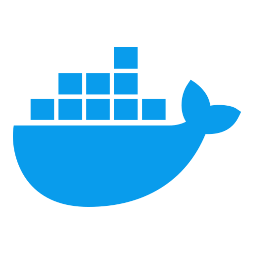

# Hi there, I'm DHN Chandan 👋

### JavaScript | TypeScript | Python | AWS | Serverless | Cloud | ReactJS | Computational Chemistry

 

### 👨‍💻 About Me

- 🔬 **Researcher** specializing in Computational Chemistry and Molecular Dynamics
- 💻 Full-stack developer passionate about **Python, JavaScript/TypeScript, and Cloud technologies**
- ☁️ **AWS & Oracle Cloud Certified Professional** with expertise in serverless architectures
- 🧬 Specializing in **Protein/Enzyme research** and computational modeling
- 🌐 Building modern web applications with **ReactJS** and cloud infrastructure
- 🔬 Bridging **Chemical Engineering** with cutting-edge **IoT & AI technologies**
- 🎯 Always exploring the intersection of **science and technology**

### 🌱 I'm currently focused on:

- 🚀 **Cloud-Native Solutions** using AWS & Oracle Cloud Infrastructure
- 🤖 **AI & Machine Learning Models** for scientific research
- ⚡ **Performance Optimization** of computational workflows
- 🏗️ **Scalable Serverless Architectures**

### 💬 Get in touch:

- 💼 Ask me about **AWS, ReactJS, Python, Protein/Enzyme, Molecular Dynamics**
- 🐦 Connect with me on **[Twitter](https://x.com/dhnchandan)**
- 💭 Discuss research on **[Dev.to](https://dev.to/dhnchandan)**
- 📧 Reach me at **php.chandan@gmail.com** (or via LinkedIn)

### 🌟 Fun Fact

> "I'm a foodie who loves to explore how technology can solve real-world problems! When I'm not coding or researching computational chemistry, you can find me trying out new recipes or exploring the intersection of food science and technology."

### 🏆 Oracle Certifications

| Certification | Badge | PDF | Certificate |
|:---:|:---:|:---:|:---:|
| **OCI Foundations** |  | [📄](./files/Oracle%20Cloud%20Infrastructure%20Foundations%20-%20Foundations%20Associate.pdf) |  |
| **OCI AI Foundations** |  | [📄](./files/Oracle%20Cloud%20Infrastructure%20AI%20Foundations%20-%20Foundations%20Associate.pdf) |  |
| **Oracle Data Platform** |  | [📄](./files/Oracle%20Data%20Platform%20Foundations%20-%20Foundations%20Associate.pdf) |  |
| **Fusion AI Agent** |  | [📄](./files/Oracle%20Fusion%20AI%20Agent%20Studio%20-%20Rel%201%20-%20Foundations%20Associate.pdf) |  |

###  Blog posts

<!-- BLOG-POST-LIST:START -->

- [Color Magic - JS Library](https://dev.to/dhnchandan/color-magic-js-library-557d)

<!-- BLOG-POST-LIST:END -->

###  Docker Hub

<!-- DOCKER_IMAGE-LIST:START -->

- [XVG Plotter](https://hub.docker.com/r/firesimulations/xvg-plotter)
- [Gromacs](https://hub.docker.com/r/firesimulations/gromacs)
- [FFTW](https://hub.docker.com/r/firesimulations/fftw)
- [Molecular Docking](https://hub.docker.com/r/firesimulations/autodocking)

<!-- DOCKER_IMAGE-LIST:END -->

### 🧬 Bioinformatics & Computational Chemistry Projects

### 🏅 Achievements & Recognition

- **Published Research**: Computational Chemistry & Molecular Dynamics studies with **[DOI: 10.5281/zenodo.10576496](https://doi.org/10.5281/zenodo.10576496)**
- **Open Source Contributions**: Maintainer of popular npm packages including **[@fly-lab/color-magic](https://www.npmjs.com/package/@fly-lab/color-magic)**
- **Certified Professional**: Oracle Cloud Infrastructure 2025 Certified Foundations Associate & AI Foundations Associate
- **Docker Hub**: Featured Docker images with **Gromacs, XVG Plotter, Molecular Docking** tools for computational chemistry

---

### 🤝 Connect with me

### 🛠️ Technologies & Tools

  
#### Languages & Frameworks

  

  
#### Frontend Development

  

  
#### Backend & Databases

  

  
#### Cloud & DevOps

  

  
#### Tools & Other Technologies

  

<h5 align="left">Programming Languages:</h5>

    <!--Python-->
    
    <!--TypeScript-->
    
    <!--JS-->
    
    <!--PHP-->
    

<h5 align="left">Front-end:</h5>

    <!--HTML5-->
    
    <!--ReactJS-->
    
    <!--VueJS-->
    

<h5 align="left">Back-end:</h5>

    <!--NodeJS-->
    
    <!--GraphQL-->
    
    <!--nginx-->
    
    <!--Postman-->
    
    <!--AWS CDK-->
    
    <!--Serverless-->
    

<h5 align="left">Database:</h5>

    <!--DynamoDB-->
    
    <!--MongoDB-->
    
    <!--MySQL-->
    
    <!--PostGresSQL-->
    

<h5 align="left">Cloud and DevOps:</h5>

    <!--AWS-->
    
    <!--Amplify-->
    
    <!--Docker-->
    
    <!--Firebase-->
    
    <!--GCP-->
    
    <!--Git-->
    
    <!--Linux-->
    

### 🏢 Organizations & Repositories

### 🔬 Featured Repositories

---

### 📊 GitHub Stats

